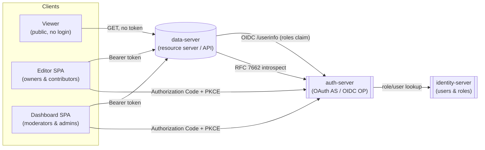
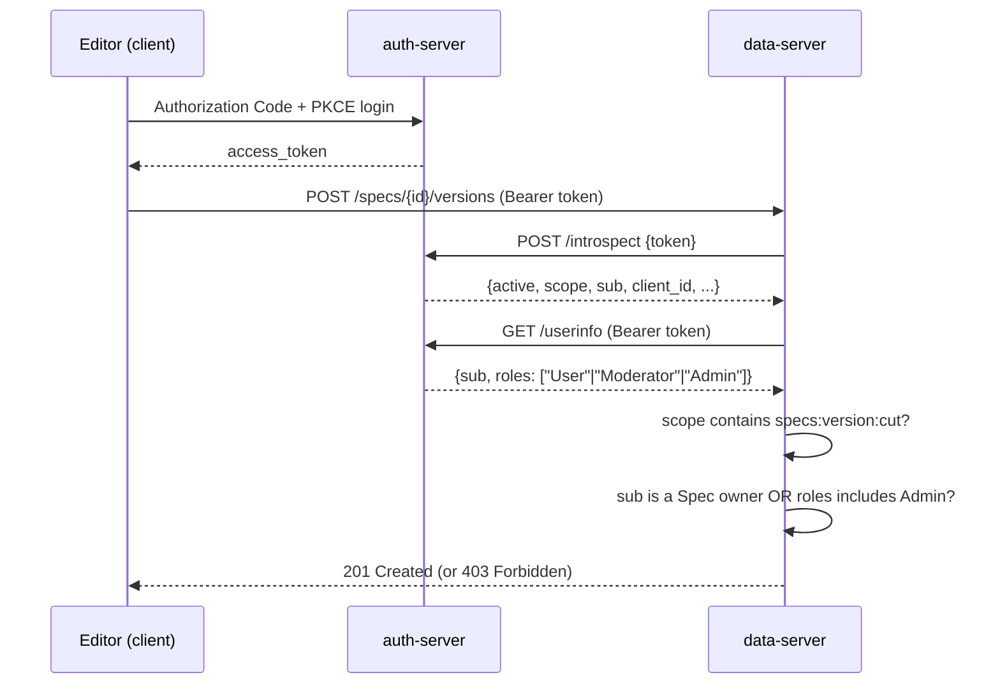

# Spec Platform — Application Design

Date: 2026-09-16

## Overview

Four services realize the domain model from [`spec-domain-design.md`](./spec-domain-design.md),
chosen deliberately to exercise different parts of OAuth 2.1 / OIDC:

1. **data-server** — the resource server. Owns all Spec domain data and
   constraints, exposes the REST API. Trusts nothing about a caller except
   what it independently verifies on each request.
2. **dashboard** — authenticated SPA for moderators/admins: review queues
   (publish requests, deprecation requests, errata), hide/unhide, delete,
   force ownership transfer.
3. **editor** — authenticated SPA for owners/contributors: create Specs,
   propose changes, cut versions, submit for publish, propose errata/
   deprecation, manage co-owners. Also where an Admin performs
   ownership-bypass content actions.
4. **viewer** — fully public/anonymous. No OAuth client registration, no
   login. Renders public reads only (never hidden Drafts).

This document covers the API surface for **data-server**: required OAuth
scope and role/ownership constraint per endpoint. It does not cover UI
design for dashboard/editor/viewer, nor data-server's persistence layer.

## Services

## Auth mechanics (per request to data-server)

Every protected endpoint performs two independent checks:

1. **Scope** — does the token's `scope` (from introspection) include the
   scope the action requires? Coarse: could this client/token ever do this
   class of thing?
2. **Role / ownership constraint** — given the caller's `sub` and `roles`
   (from OIDC `/userinfo`), is *this specific* action allowed on *this
   specific* Spec? Fine: is this actual actor allowed, right now, on this
   resource?

Both must pass. Public (unauthenticated) endpoints skip both checks
entirely — per-request, data-server never requires a token to read
non-hidden content. Token validation is via introspection (RFC 7662)
rather than local JWT verification, so tokens can be revoked
server-side and data-server never needs auth-server's signing keys.

## Scope catalog

Scopes are fine-grained, one per distinct action, so client consent and
audit logs stay precise.

| Scope | Granted to (client) | Action it gates |
|---|---|---|
| `specs:create` | editor | Create a Spec |
| `specs:read:hidden` | editor, dashboard | Read a hidden Draft |
| `specs:version:cut` | editor | Cut a new version |
| `specs:proposal:create` | editor | Propose a change |
| `specs:proposal:review` | editor | Accept/reject a change proposal |
| `specs:publish-request:submit` | editor | Submit a publish request |
| `specs:publish-request:review` | dashboard | Approve/reject a publish request |
| `specs:visibility:manage` | dashboard | Hide/unhide a Draft |
| `specs:deprecation:propose` | editor | Propose deprecation |
| `specs:deprecation:review` | dashboard | Approve/reject a deprecation request |
| `specs:erratum:propose` | editor | Propose an erratum |
| `specs:erratum:review` | dashboard | Approve/reject an erratum |
| `specs:owner:invite` | editor | Invite / revoke a co-owner invitation |
| `specs:owner:invite:respond` | editor | Accept / decline an invitation addressed to you |
| `specs:owner:remove` | editor | Remove a co-owner |
| `specs:owner:force-add` | dashboard | Admin-only: add an owner directly, bypassing invite/accept |
| `specs:delete` | dashboard | Delete a Draft/Published/Deprecated Spec |

## API endpoints

Public = no token, no checks. `sub`/`roles` come from `/userinfo`; `scope`
comes from introspection.

### Specs

| Endpoint | Scope | Constraint |
|---|---|---|
| `GET /specs`, `GET /specs/{id}` | *(public)* | Hidden Drafts excluded/404 unless `specs:read:hidden` + (`sub` ∈ owners OR `roles` ⊇ Moderator) |
| `POST /specs` | `specs:create` | any User (caller becomes sole initial owner) |
| `DELETE /specs/{id}` | `specs:delete` | `roles` ⊇ Admin |

### Versions

| Endpoint | Scope | Constraint |
|---|---|---|
| `GET /specs/{id}/versions[/{n}]` | *(public)*, or `specs:read:hidden` if parent is a hidden Draft | same hidden-Draft rule as above |
| `POST /specs/{id}/versions` | `specs:version:cut` | `sub` ∈ owners OR `roles` ⊇ Admin; Spec.status == Draft |

### Change proposals

| Endpoint | Scope | Constraint |
|---|---|---|
| `GET /specs/{id}/proposals` | *(public)*, hidden-Draft rule applies | — |
| `POST /specs/{id}/proposals` | `specs:proposal:create` | any User; Spec.status == Draft |
| `POST /specs/{id}/proposals/{pid}/accept`, `/reject` | `specs:proposal:review` | `sub` ∈ owners OR `roles` ⊇ Admin |

### Publish requests

| Endpoint | Scope | Constraint |
|---|---|---|
| `GET /specs/{id}/publish-requests` | *(public)*, hidden-Draft rule applies | — |
| `POST /specs/{id}/publish-requests` | `specs:publish-request:submit` | `sub` ∈ owners OR `roles` ⊇ Admin; Draft, not hidden, no existing Pending request |
| `POST /specs/{id}/publish-requests/{rid}/approve`, `/reject` | `specs:publish-request:review` | `roles` ⊇ Moderator |

### Visibility

| Endpoint | Scope | Constraint |
|---|---|---|
| `POST /specs/{id}/hide`, `/unhide` | `specs:visibility:manage` | `roles` ⊇ Moderator; Spec.status == Draft |

### Deprecation requests

| Endpoint | Scope | Constraint |
|---|---|---|
| `GET /specs/{id}/deprecation-requests` | *(public)* | — |
| `POST /specs/{id}/deprecation-requests` | `specs:deprecation:propose` | any User; Spec.status == Published |
| `POST /specs/{id}/deprecation-requests/{rid}/approve`, `/reject` | `specs:deprecation:review` | `roles` ⊇ Moderator |

### Errata

| Endpoint | Scope | Constraint |
|---|---|---|
| `GET /specs/{id}/errata` | *(public for Approved)*; Pending/Rejected visible only to proposer, owners, `roles` ⊇ Moderator | — |
| `POST /specs/{id}/errata` | `specs:erratum:propose` | any User; Spec.status ∈ {Published, Deprecated} |
| `POST /specs/{id}/errata/{eid}/approve`, `/reject` | `specs:erratum:review` | `roles` ⊇ Moderator |

### Ownership

| Endpoint | Scope | Constraint |
|---|---|---|
| `GET /specs/{id}/owners` | *(public)* | — |
| `POST /specs/{id}/owner-invitations` | `specs:owner:invite` | `sub` ∈ owners |
| `DELETE /specs/{id}/owner-invitations/{iid}` (revoke) | `specs:owner:invite` | inviting owner OR `roles` ⊇ Admin |
| `POST /specs/{id}/owner-invitations/{iid}/accept`, `/decline` | `specs:owner:invite:respond` | `sub` == invitee |
| `DELETE /specs/{id}/owners/{userId}` | `specs:owner:remove` | `sub` ∈ owners; must not be the last remaining owner, unless `roles` ⊇ Admin |
| `POST /specs/{id}/owners` (force-add, bypasses invite/accept) | `specs:owner:force-add` | `roles` ⊇ Admin |
