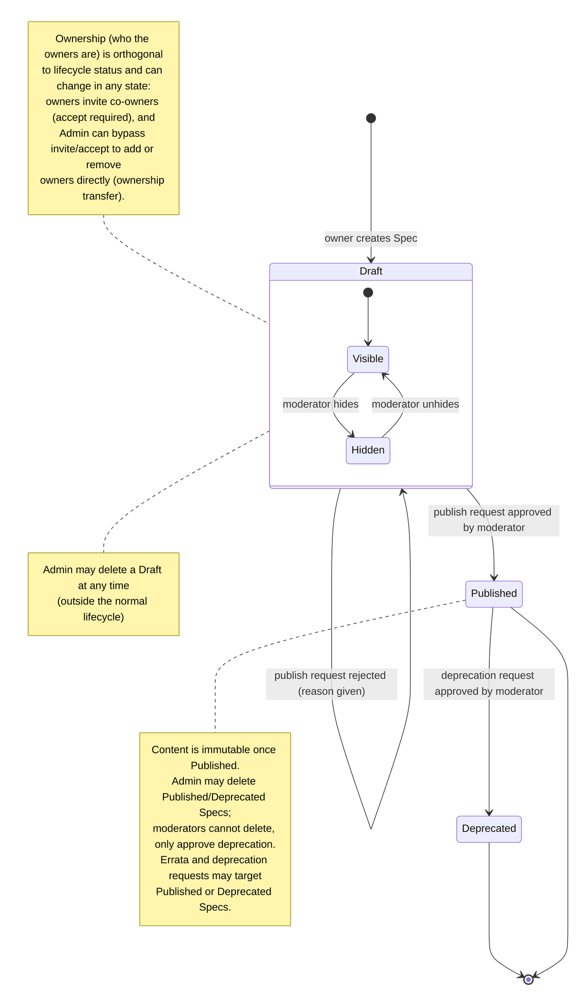
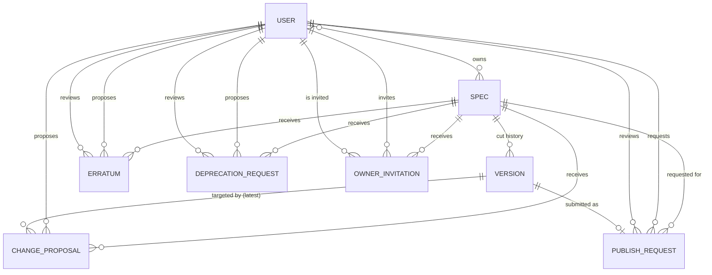

# Spec Platform — Domain Design

Date: 2026-09-16

## Overview

An RFC-like publishing domain: users own **Specs** (one or more co-owners
per Spec) that move through a `Draft → Published → Deprecated` lifecycle.
Anyone can contribute to a Draft, but only an owner turns contributions into
versions, and only a Moderator can approve publishing, hiding, deprecation,
and errata. Admins have full control: they can bypass ownership entirely,
transfer/reassign owners, and delete — none of which any other role can do
to a Published or Deprecated Spec.

This document covers the domain model only — entities, lifecycle, and
authorization rules. It does not cover API shape, persistence, or how this
plugs into `identity-server` / `auth-server` / `policy-agent`.

Modeling style follows `identity-server`'s existing convention: plain rich
entities with invariants enforced on construction/mutation, not event
sourcing.

## Terminology

- **Spec** — the core document unit (short for Specification). Has one or
  more owners (co-ownership via invite + accept), a version history, and a
  lifecycle status.
- **Version** — an immutable snapshot of a Spec's content, cut explicitly by
  an owner.
- **Contributor** — any authenticated user proposing a change to a Draft.
  Not a distinct role; any `User` can act as a contributor.
- **Role** — a user's global privilege tier: `User`, `Moderator`, `Admin`.

## Entities

- **Spec**
  `id`, `title`, `owners` (set of `user_id`, see Relationships),
  `status` (`Draft | Published | Deprecated`),
  `hidden: bool` (meaningful only while `status == Draft`),
  `current_version_id`, `deprecation_reason?`

- **Version**
  `id`, `spec_id`, `number`, `content`, `cut_by` (an owner), `cut_at`.
  Immutable once created.

- **OwnerInvitation**
  `id`, `spec_id`, `invited_by` (an owner, or Admin), `invitee_id`,
  `status` (`Pending | Accepted | Declined | Revoked`)

- **ChangeProposal**
  `id`, `spec_id`, `target_version_id`, `proposer_id`, `content`,
  `status` (`Pending | Accepted | Rejected`)

- **PublishRequest**
  `id`, `spec_id`, `version_id`, `requested_by`,
  `status` (`Pending | Approved | Rejected`), `reviewed_by?`,
  `rejection_reason?`

- **DeprecationRequest**
  `id`, `spec_id`, `proposer_id`, `reason`,
  `status` (`Pending | Approved | Rejected`), `reviewed_by?`

- **Erratum**
  `id`, `spec_id`, `proposer_id`, `content`,
  `status` (`Pending | Approved | Rejected`), `reviewed_by?`

## Lifecycle

## Relationships

## Roles & Permissions

Role-gated permissions are cumulative upward: `Admin ⊇ Moderator ⊇ User`.
Ownership is a separate, independent axis — outranking `User` does not make
a Moderator the owner of someone else's Spec. **Admin is the one exception:
Admin bypasses ownership entirely** and may perform any ownership-scoped
action on any Spec without being one of its owners.

**Ownership-scoped** (a current Spec owner, or Admin bypassing ownership):

| Action | Requires |
|---|---|
| Create Spec (becomes sole initial owner) | any User |
| Accept/reject a change proposal | Spec owner, or Admin |
| Cut a new version | Spec owner, or Admin |
| Submit publish request | Spec owner, or Admin |
| Invite a co-owner | Spec owner, or Admin (bypasses invite/accept — adds directly) |
| Revoke a pending OwnerInvitation | inviting owner, or Admin |
| Remove a co-owner (Spec must retain ≥1 owner) | Spec owner, or Admin |

**Invitee-only:**

| Action | Requires |
|---|---|
| Accept or decline an OwnerInvitation | the invited user |

**Open to any authenticated user** (no ownership or elevated role needed):

| Action | Requires |
|---|---|
| Propose change to a Draft | any User |
| Propose deprecation of a Published Spec (reason required) | any User |
| Propose an Erratum | any User |

**Role-gated** (minimum role; inherited upward):

| Action | Minimum role |
|---|---|
| Approve/reject a publish request | Moderator |
| Hide/unhide a Draft | Moderator |
| Approve/reject a deprecation request | Moderator |
| Approve/reject an Erratum | Moderator |
| Delete a Draft, Published, or Deprecated Spec | Admin |
| Manage moderators/users | Admin |

## Invariants

1. A Spec can have at most one `Pending` PublishRequest at a time.
2. A Spec can have at most one `Pending` DeprecationRequest at a time (only
   submittable while `status == Published`).
3. Change proposals can only be accepted while `status == Draft`.
4. A hidden Draft cannot have its publish request approved while still
   hidden (must be unhidden first) — prevents publishing content a
   moderator flagged.
5. Once `Published`, a Version's content is frozen forever; evolution
   happens via a new, separate Spec (optionally "supersedes" the old one),
   not by mutating the old one.
6. A DeprecationRequest requires a non-empty `reason`; on approval,
   `Spec.status → Deprecated` and `Spec.deprecation_reason` is set from the
   approved request.
7. Deletion is admin-only and total (removes the Spec and its history) —
   the sole exception to "published is never removed by a moderator."
8. Role permissions are cumulative upward (`Admin ⊇ Moderator ⊇ User`);
   ownership-scoped actions are independent of role tier and require the
   acting user to actually be one of the Spec's owners — **except Admin,
   which bypasses ownership entirely.**
9. A Spec must always have at least one owner. Removing the last remaining
   owner is not allowed; an Admin reassigning ownership must add the new
   owner (bypassing invite/accept) in the same operation as, or before,
   removing the last existing owner, so a Spec is never ownerless. Only
   Admin deletion removes a Spec — and its ownership — entirely.
10. Adding a co-owner normally requires invite + accept (an `OwnerInvitation`
    that the invitee must explicitly accept). Admin is the only actor that
    can add an owner directly, bypassing that flow — this is how ownership
    transfer works when the original owner is unavailable or uncooperative.
